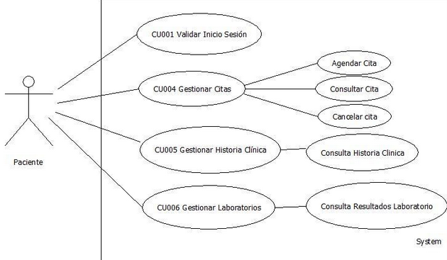
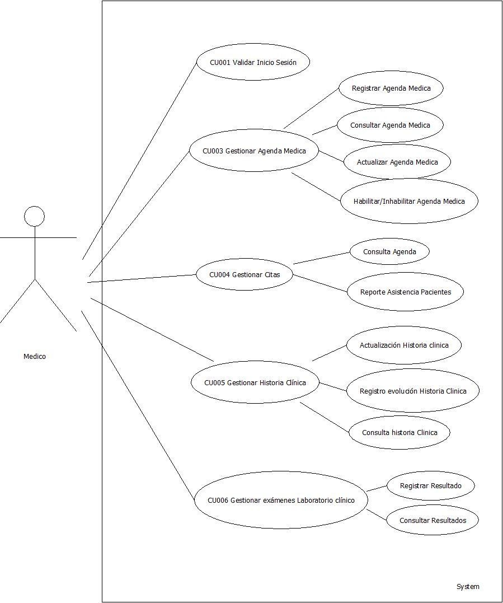
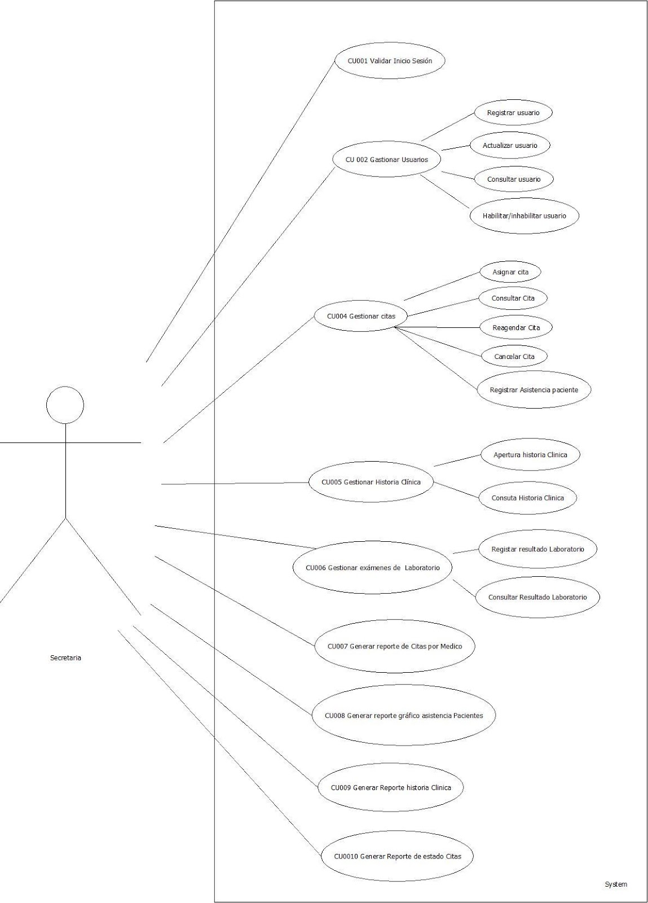

Proyecto

Sistema de Información para la Gestión de solucion de citas en entorno Web,

Historial Clínico y Exámenes del Consultorio de Concentrados y mascotas
Olarte

**Desarrollado por:**

Leydy Katherine Lesmes Fernández

Haroldo De Zubiria Ocampo

Giovanni Urrego Herrera

**Aprendices:**

Kevin David Rodriguez Riveros

David Vargas Monroy

**SENA 2019**

## 

## Introducción 

En este documento encontrarán los elementos de definición y diseño para
la implementación de un sistema, donde se propone un caso de estudio
para que construya una solución a la problemática planteada. El éxito de
la entrega en cada una de las tareas dependerá del análisis de la
problemática y de la destreza en la aplicación de sus conocimientos y
habilidades.

## DescripCIÓN DEL caso (PROBLEMA)

El consultorio médico Concentrados y mascotas Olarte, tiene en la
actualidad el manejo del agendamiento de citas el cual se realiza vía
telefónica o personalmente en su consultorio, haciendo un registro en
una hoja de Excel, por parte de la secretaria, en donde se ha presentado
la dificultad de tener que registrar toda la información cada vez que
hay una cita. Adicionalmente se han presentado cruce de horarios al
asignar una misma cita a dos pacientes diferentes con un mismo médico ya
que no existe un control de la información adecuado.

Al ingresar un paciente por primera vez al consultorio, se debe hacer la
apertura de la historia clínica el cuál se lleva en un formato físico
que se va actualizando toda vez que un paciente genera una nueva
consulta. Dicho historial se almacena en una zona donde puede suceder
que se pierda o se dañe, debido a las condiciones del lugar, generando
que cualquier persona manipule la información sin tener los permisos
para hacerlo.

De acuerdo al diagnóstico generado por el Doctor, para algunos pacientes
se solicita la toma de ciertos exámenes médicos cuyos resultados no se
pueden consultar de forma inmediata sin revisar el historial físico que
también se maneja para esta circunstancia, lo cual vuelve tedioso y poco
eficiente el procedimiento de seguimiento médico del paciente.

Se necesita un sistema de información acorde a las problemáticas del
lugar y de los procesos manejados internamente, que permita realizar la
siguientes funciones: agendamiento y control de citas médicas, registro
y evolución de la historia clínica de cada paciente y manejo de exámenes
de laboratorio clínico.

¿Es oportuno desarrollar un sistema de información que permita dar
solución a las necesidades anteriormente mencionadas?

## OBJETIVOS DEL PROYECTO

**OBJETIVO GENERAL**

Desarrollar un Sistema de Información para la Gestión de citas,
Historial Clínico y Exámenes del Consultorio del Consultorio
Concentrados y mascotas Olarte

**OBJETIVOS ESPECÍFICOS (1 POR CADA FASE)**

-   Interpretar la documentación suministrada para el desarrollo del
    Sistema de Información.

-   Definir las actividades y tiempos de ejecución requeridos para el
    desarrollo e implementación del Software de Gestión de consultorio
    médico.

-   Diseñar la interfaz gráfica del sistema de información de acuerdo a
    los requisitos suministrados en la documentación.

-   Desarrollar el aplicativo que da solución al problema del Doctor
    Rodríguez empleando las herramientas de diseño y programación
    necesarias.

-   Implantar la solución en un ambiente real, realizando las
    respectivas pruebas de calidad del software de gestión de
    consultorios.

## ALCANCE DEL PROYECTO

El Sistema de Información para la Gestión de citas, Historial Clínico y
Exámenes del Consultorio del Concentrados y Mascotas Olarte estará
desarrollado únicamente para solventar las necesidades planteadas por el
cliente, las cuáles son (tiempo de desarrollo).

-   Agendamiento y control de citas médicas: Gestión de calendario
    electrónico para agendamiento de citas On-Line donde los pacientes
    tendrán la opción de agendar y cancelar por si mismos sus citas
    médicas.

-   Registro y evolución de la historia clínica de cada paciente:
    Organizar la información digitalmente de todos los estudios
    realizados a los pacientes con fácil acceso a la información

-   Manejo de exámenes de laboratorio clínico: Visualiza de manera
    sencilla y ágil los resultados de los análisis de laboratorios e
    imágenes diagnósticos.

Adicionalmente se debe cumplir con los parámetros de la implementación
de buenas prácticas de desarrollo de software como:

-   Control de usuarios (Perfiles).

-   Validación de los datos ingresados.

-   La implementación debe emplear Diseño RESPONSIVE en entorno WEB.

-   Se debe implementar siguiendo el patrón MVC (Modelo Vista
    Controlador).

-   Se desarrollará en un tiempo de 18 meses bajo los lenguajes de
    programación ASP o PHP.

-   Para el manejo de la base de datos se emplearán los motores de bases
    de datos SQLServer o MySql.

## DescripCIÓN DE TAREAS

Las necesidades que presenta la empresa se sintetiza en el ESTUDIO DE
CASO "Sistema de Información para la Gestión de citas, Historial Clínico
y Exámenes del Consultorio Concentrados y mascotas Olarte", la
información relevante frente al proceso que lleva actualmente la
empresa, se complementa con el material de apoyo que incluye los anexos
necesarios para su desarrollo, este se encuentra en la carpeta
denominada MATERIAL DE APOYO DEL PROYECTO.

Table Example:
| First Header  | Second Header |
| ------------- | ------------- |
| Content Cell  | Content Cell  |
| Content Cell  | Content Cell  |

table example 2:
| general |
| #1 | bla bla |
| #2 | ble ble |

**TAREA 1. LECTURA Y ANÁLISIS DEL DOCUMENTO**

### TAREA 2. MAQUETACIÓN WEB DEL PROYECTO

### TAREA 3. CONSTRUCCIÓN DE LA INTERFAZ GRÁFICA

**TAREA 4. CONSTRUCCIÓN DE LA BASE DE DATOS**

**TAREA 5. INTEGRACIÓN DE LA BASE DE DATOS CON LA INTERFAZ GRÁFICA**

**TAREA 6. GENERACIÓN DE REPORTES**

Reporte de Citas por médico.

Gráfico de asistencia de los pacientes a las citas por especialidad

Reporte de Historia clínica por paciente

Reporte de estado de citas cumplidas por agenda médica

**TAREA 7. IMPLANTACIÓN DEL PROYECTO**

**TAREA 8. PRUEBAS DE FUNCIONALIDAD (TESTING)**

**ANEXO 1. REQUISITOS FUNCIONALES**
| Codigo | requisitos funcionales |
|-|-|
| **RQF001** | Nombre: Validación de inicio de sesión |
|  | Descripción: El sistema debe permitir validar el usuario que empleará el software a través del manejo de usuario y contraseña. |
|  | Usuarios: Médico, Secretaria, Paciente |

| Codigo | requisitos funcionales |
|-|-|
| **RQF002** | Nombre: Gestión de Usuarios |
|  |Descripción: El sistema debe permitir la gestión del usuario donde se puedan registrar, consultar, modificar o habilitar/inhabilitar un usuario. |
|  |Usuarios: Secretaria |

| Codigo | requisitos funcionales |
|-|-|
| **RQF003** |  Nombre: Gestión de Agenda médica |
|  | Descripción: El sistema debe permitir realizar la gestión de la agenda para programar las citas de los médicos realizando el registro, consulta, modificación y habilitar/inhabilitar los horarios de las citas médicas, de acuerdo a la disponibilidad de cada profesional. |
|  | Usuarios: Médico |

| Codigo | requisitos funcionales |
|-|-|
| **RQF004** |  Nombre: Gestión de Agendamiento de citas para pacientes |
|  | Descripción: El sistema debe permitir realizar la gestión del calendario electrónico para agendamiento de citas On-Line o vía telefónica donde los pacientes y la secretaria, tendrán la opción de agendar y cancelar las citas médicas. |
|  | Usuarios: Secretaria, paciente |

| Codigo | requisitos funcionales |
|-|-|
| **RQF005** | Nombre: Gestión de la historia clínica de cada paciente |
|  | Descripción: El sistema debe permitir registrar, consultar, actualizar la información digitalmente de todos los estudios realizados a los pacientes. |
|  | El usuario secretaria sólo hará apertura (registro datos básicos del paciente) y consulta de la historia clínica. |
|  | El usuario paciente podrá consultar su historia clínica en el aplicativo. |

| Codigo | requisitos funcionales |
|-|-|
| **RQF006** | Nombre: Manejo de exámenes de laboratorio clínico |
|  | Descripción: El sistema debe permitir Registrar y Consultar de manera sencilla y ágil los resultados de los análisis de laboratorios e imágenes diagnósticos. |
|  | El usuario Medico podrá consultar los resultados de los exámenes de todos sus pacientes |
|  | El usuario paciente podrá consultar los resultados de sus exámenes. |
|  | Usuarios: Secretaria, Médico, Paciente |

| Codigo | requisitos funcionales |
|-|-|
| **RQF007** | Nombre: Generar Reporte de Citas por Médico |
|  | Descripción: El sistema debe permitir Generar un Reporte de las citas asignadas diariamente por cada uno de los médicos |
|  | Usuarios: Secretaria |

| Codigo | requisitos funcionales |
|-|-|
| **RQF008** | Nombre: Generar Reporte Gráfico de asistencia de los pacientes a las citas por especialidad |
|  | Descripción: El sistema debe permitir Generar un Reporte gráfico de la asistencia de los pacientes a cada una de las especialidades de forma mensual. |
|  | Usuarios: Secretaria |

| Codigo | requisitos funcionales |
|-|-|
| **RQF009** | Nombre: Generar Reporte de Historia clínica por paciente |
|  | Descripción: El sistema debe permitir Generar un Reporte de la historia clínica de cada paciente de acuerdo a una solicitud generada por un usuario. |
|  | Usuarios: Secretaria |

| Codigo | requisitos funcionales |
|-|-|
| **RQF010** | Nombre: Generar Reporte de estado de citas cumplidas por agenda médica |
|  | Descripción: El sistema debe permitir Generar un Reporte del estado de cumplimiento de las citas agendadas diariamente. |
|  | Usuarios: Secretaria |

**ANEXO 2. REQUISITOS NO FUNCIONALES**

| Codigo | requisitos NO funcionales |
|-|-|
| **RQNF001** | Nombre: Portabilidad |
|  | Descripción: El sistema debe ejecutar todas las funciones para las cuales está diseñado en los siguientes navegadores: Chrome y Firefox. |

| Codigo | requisitos NO funcionales |
|-|-|
| **RQNF002** | Nombre: Seguridad de Autenticación |
|  | Descripción: El sistema debe permitir el ingreso solo de los usuarios registrados. |

| Codigo | requisitos NO funcionales |
|-|-|
| **RQNF003** | Nombre: Seguridad Autorización |
|  | Descripción: El sistema debe controlar el acceso a las tareas de acuerdo al rol de cada usuario. |

**ANEXO 3. DIAGRAMAS Y DOCUMENTACIÓN DE CASOS USO**

<table style="width:100%">
    <tr>
        <th colspan="4">1. IDENTIFICACIÓN DE CASO DE USO</th>
    </tr>
    <tr>
        <th>1.1 Id Caso</th>
        <th>CU001</th>
        <th>1.2 Nombre</th>
        <th>Validar Inicio de Sesión</th>
    </tr>
     <tr>
        <th colspan="4">1.  HISTORICO DE CASO DE USO</th>
    </tr>
    <tr>
        <th>2.1 Autores</th>
        <th colspan="3">Kevin David Rodriguez Riveros - David Vargas Monroy</th>
    </tr>
    <tr>
        <th>2.2 Fecha Creación </th>
        <th>5-5-2019</th>
        <th colspan="2">1. Última Actualización</th>
    </tr>
    <tr>
        <th>2.4 Actualizado por</th>
        <th>Kevin Rodriguez</th>
        <th> </th>
        <th>1.0</th>
    </tr>
    <tr>
        <th colspan="4">1. DEFINICION DE UN CASO DE USO</th>
    </tr>
    <tr>
        <th colspan="4"> **3.1 DESCRIPCIÓN** </th>
    </tr>
    <tr>
        <th colspan="4"> Permite validar el inicio de sesión </th>
    </tr>
    <tr>
        <th colspan="4"> **3.2 ACTORES** </th>
    </tr>
    <tr>
        <th colspan="4"> Admon, Medico, Secretaria, Cliente. </th>
    </tr>
     <tr>
        <th colspan="4"> **3.3 PRECONDICIONES**  </th>
    </tr>
    <tr>
        <th colspan="4"> 1.  El usuario debe estar autenticado en el sistema </th>
    </tr>
    <tr>
        <tr>
            <th colspan="4"> **3.4 FLUJO NORMAL** </th>
        </tr>
        <tr>
            <th colspan="4"> Contando con las precondiciones el flujo normal será el siguiente: </th>
        </tr>
        <tr>
            <tr>
                <th> Paso </th>
                <th> Actor </th>
                <th colspan="2"> Sistema </th>
            </tr>
            <tr>
                <th> 1 </th>
                <th> Ingresa sus datos </th>
                <th colspan="2"> Verifica si los datos son correctos </th>
            </tr>
            <tr>
                <th> 2 </th>
                <th> Escoge la opción de cambiar contraseña </th>
                <th colspan="2"> El sistema da un límite de caracteres y cambia su contraseña </th>
            </tr>
            <tr>
                <th> 3 </th>
                <th>  </th>
                <th colspan="2"> Muestra el mensaje: “Su contraseña ha sido cambiada” </th>
            </tr>
            <tr>
                <th> 4 </th>
                <th>  </th>
                <th colspan="2">  </th>
            </tr>
            <tr>
                <th> 5 </th>
                <th>  </th>
                <th colspan="2">  </th>
            </tr>
            <tr>
                <th>   </th>
                <th>   </th>
                <th colspan="2">   </th>
            </tr>
        </tr>
    </tr>
    <tr>
        <th colspan="4"> 3.5 FLUJO ALTERNATIVO  </th>
    </tr>
    <tr>
        <tr>
            <th colspan="4"> 3.6 FLUJO EXCEPCIONAL </th>
        </tr>
        <tr>
            <tr>
                <th> Paso </th>
                <th> Actor </th>
                <th colspan="2"> Sistema </th>
            </tr>
            <tr>
                <th> 1 </th>
                <th> Digita mal sus datos </th>
                <th colspan="2"> No valida inicio de sesion </th>
            </tr>
        </tr>
    </tr>
    <tr>
        <th colspan="4"> 3.7 POS CONDICIONES </th>
    </tr>
    <tr>
        <th colspan="4"> Sistema </th>
    </tr>
    <tr>
        <th colspan="4"> 3.8 FRECUENCIA </th>
    </tr>
    <tr>
        <th colspan="4" > Qué frecuencia tiene el CU Alta Media Baja </th>
    </tr>
</table>

<table style="width:100%">
    <tr>
        <th colspan="4">1. IDENTIFICACIÓN DE CASO DE USO</th>
    </tr>
    <tr>
        <th>1.1 Id Caso</th>
        <th>CU002</th>
        <th>1.2 Nombre</th>
        <th>Gestionar Usuarios</th>
    </tr>
     <tr>
        <th colspan="4">2.  HISTORICO DE CASO DE USO</th>
    </tr>
    <tr>
        <th>2.1 Autores</th>
        <th colspan="3">Kevin David Rodriguez Riveros - David Vargas Monroy</th>
    </tr>
    <tr>
        <th>2.2 Fecha Creación </th>
        <th>5-5-2019</th>
        <th colspan="2">1. Última Actualización</th>
    </tr>
    <tr>
        <th>2.4 Actualizado por</th>
        <th>Kevin Rodriguez</th>
        <th> </th>
        <th>1.0</th>
    </tr>
    <tr>
        <th colspan="4">1. DEFINICION DE UN CASO DE USO</th>
    </tr>
    <tr>
        <th colspan="4"> **3.1 DESCRIPCIÓN** </th>
    </tr>
    <tr>
        <th colspan="4"> Permite validar el inicio de sesión </th>
    </tr>
    <tr>
        <th colspan="4"> **3.2 ACTORES** </th>
    </tr>
    <tr>
        <th colspan="4"> Secretaria. </th>
    </tr>
     <tr>
        <th colspan="4"> **3.3 PRECONDICIONES**  </th>
    </tr>
    <tr>
        <th colspan="4"> 1.  El usuario debe estar autenticado en el sistema </th>
    </tr>
    <tr>
        <tr>
            <th colspan="4"> **3.4 FLUJO NORMAL** </th>
        </tr>
        <tr>
            <th colspan="4"> Contando con las precondiciones el flujo normal será el siguiente: </th>
        </tr>
        <tr>
            <tr>
                <th> Paso </th>
                <th> Actor </th>
                <th colspan="2"> Sistema </th>
            </tr>
            <tr>
                <th> 1 </th>
                <th> Ingresa sus datos </th>
                <th colspan="2"> Verifica si los datos son correctos </th>
            </tr>
            <tr>
                <th> 2 </th>
                <th> Escoge la opción de gestionar usuarios </th>
                <th colspan="2"> El sistema despliega las opciones </th>
            </tr>
            <tr>
                <th> 3 </th>
                <th> El usuario escoge que opción quiere realizar </th>
                <th colspan="2"> Escoge entre Registrar, Actualizar, Consultar o Eliminar Usuario </th>
            </tr>
            <tr>
                <th> 4 </th>
                <th>  </th>
                <th colspan="2"> Elabora la acción  </th>
            </tr>
            <tr>
                <th> 5 </th>
                <th>  </th>
                <th colspan="2">  </th>
            </tr>
            <tr>
                <th>   </th>
                <th>   </th>
                <th colspan="2">   </th>
            </tr>
        </tr>
    </tr>
    <tr>
        <th colspan="4"> 3.5 FLUJO ALTERNATIVO  </th>
    </tr>
    <tr>
        <tr>
            <th colspan="4"> 3.6 FLUJO EXCEPCIONAL </th>
        </tr>
        <tr>
            <tr>
                <th> Paso </th>
                <th> Actor </th>
                <th colspan="2"> Sistema </th>
            </tr>
            <tr>
                <th> 1 </th>
                <th> Digita mal sus datos </th>
                <th colspan="2"> No entra al sistema </th>
            </tr>
        </tr>
    </tr>
    <tr>
        <th colspan="4"> 3.7 POS CONDICIONES </th>
    </tr>
    <tr>
        <th colspan="4"> Sistema </th>
    </tr>
    <tr>
        <th colspan="4"> 3.8 FRECUENCIA </th>
    </tr>
    <tr>
        <th colspan="4" > Qué frecuencia tiene el CU Alta Media Baja </th>
    </tr>
</table>

<table style="width:100%">
    <tr>
        <th colspan="4">1. IDENTIFICACIÓN DE CASO DE USO</th>
    </tr>
    <tr>
        <th>1.1 Id Caso</th>
        <th>CU003</th>
        <th>1.2 Nombre</th>
        <th>Gestionar Médicos</th>
    </tr>
     <tr>
        <th colspan="4">2.  HISTORICO DE CASO DE USO</th>
    </tr>
    <tr>
        <th>2.1 Autores</th>
        <th colspan="3">Kevin David Rodriguez Riveros - David Vargas Monroy</th>
    </tr>
    <tr>
        <th>2.2 Fecha Creación </th>
        <th>5-5-2019</th>
        <th colspan="2">1. Última Actualización</th>
    </tr>
    <tr>
        <th>2.4 Actualizado por</th>
        <th>Kevin Rodriguez</th>
        <th> </th>
        <th>1.0</th>
    </tr>
    <tr>
        <th colspan="4">1. DEFINICION DE UN CASO DE USO</th>
    </tr>
    <tr>
        <th colspan="4"> **3.1 DESCRIPCIÓN** </th>
    </tr>
    <tr>
        <th colspan="4"> Permite gestionar médicos </th>
    </tr>
    <tr>
        <th colspan="4"> **3.2 ACTORES** </th>
    </tr>
    <tr>
        <th colspan="4"> Admon. </th>
    </tr>
     <tr>
        <th colspan="4"> **3.3 PRECONDICIONES**  </th>
    </tr>
    <tr>
        <th colspan="4"> 1.  El usuario debe estar autenticado en el sistema </th>
    </tr>
    <tr>
        <tr>
            <th colspan="4"> **3.4 FLUJO NORMAL** </th>
        </tr>
        <tr>
            <th colspan="4"> Contando con las precondiciones el flujo normal será el siguiente: </th>
        </tr>
        <tr>
            <tr>
                <th> Paso </th>
                <th> Actor </th>
                <th colspan="2"> Sistema </th>
            </tr>
            <tr>
                <th> 1 </th>
                <th> Ingresa sus datos </th>
                <th colspan="2"> Verifica si los datos son correctos </th>
            </tr>
            <tr>
                <th> 2 </th>
                <th> Escoge la opción de gestionar médicos  </th>
                <th colspan="2"> El sistema despliega las opciones </th>
            </tr>
            <tr>
                <th> 3 </th>
                <th> El usuario escoge que opción quiere realizar </th>
                <th colspan="2"> Escoge entre Registrar, Actualizar, Consultar o Eliminar Médico </th>
            </tr>
            <tr>
                <th> 4 </th>
                <th>  </th>
                <th colspan="2"> Elabora la acción  </th>
            </tr>
            <tr>
                <th> 5 </th>
                <th>  </th>
                <th colspan="2">  </th>
            </tr>
            <tr>
                <th>   </th>
                <th>   </th>
                <th colspan="2">   </th>
            </tr>
        </tr>
    </tr>
    <tr>
        <th colspan="4"> 3.5 FLUJO ALTERNATIVO  </th>
    </tr>
    <tr>
        <tr>
            <th colspan="4"> 3.6 FLUJO EXCEPCIONAL </th>
        </tr>
        <tr>
            <tr>
                <th> Paso </th>
                <th> Actor </th>
                <th colspan="2"> Sistema </th>
            </tr>
            <tr>
                <th> 1 </th>
                <th> Digita mal sus datos </th>
                <th colspan="2"> No entra al sistema </th>
            </tr>
        </tr>
    </tr>
    <tr>
        <th colspan="4"> 3.7 POS CONDICIONES </th>
    </tr>
    <tr>
        <th colspan="4"> Sistema </th>
    </tr>
    <tr>
        <th colspan="4"> 3.8 FRECUENCIA </th>
    </tr>
    <tr>
        <th colspan="4" > Qué frecuencia tiene el CU Alta Media Baja </th>
    </tr>
</table>
+----------------+----------------+----------------+----------------+
| 4.             |                |                |                |
| IDENTIFICACIÓN |                |                |                |
|     DE CASO DE |                |                |                |
|     USO        |                |                |                |
+================+================+================+================+
| 1.1 Id Caso    | CU004          | 1.2 Nombre     | Historia       |
|                |                |                | Clinica        |
+----------------+----------------+----------------+----------------+
| 4.  HISTORICO  |                |                |                |
|     DE CASO DE |                |                |                |
|     USO        |                |                |                |
+----------------+----------------+----------------+----------------+
| 2.1 Autor      | Kevin David    |                |                |
|                | Rodriguez      |                |                |
|                | Riveros-David  |                |                |
|                | Vargas Monroy  |                |                |
+----------------+----------------+----------------+----------------+
| 2.2 Fecha      | 5-5-2019       | 1.  Última     |                |
| Creación       |                |     >          |                |
|                |                |  Actualización |                |
+----------------+----------------+----------------+----------------+
| 2.4            | Kevin          |                | 1.0            |
| Actualizado    | Rodriguez      |                |                |
| por            |                |                |                |
+----------------+----------------+----------------+----------------+
| 4.  DEFINICION |                |                |                |
|     DE UN CASO |                |                |                |
|     DE USO     |                |                |                |
+----------------+----------------+----------------+----------------+
| **3.1          |                |                |                |
| DESCRIPCIÓN**  |                |                |                |
+----------------+----------------+----------------+----------------+
| Permite        |                |                |                |
| gestionar      |                |                |                |
| historia       |                |                |                |
| clinica        |                |                |                |
+----------------+----------------+----------------+----------------+
| **3.2          |                |                |                |
| ACTORES**      |                |                |                |
+----------------+----------------+----------------+----------------+
| Admon, Medico  |                |                |                |
+----------------+----------------+----------------+----------------+
| **3.3          |                |                |                |
| PR             |                |                |                |
| ECONDICIONES** |                |                |                |
+----------------+----------------+----------------+----------------+
| 1.  El usuario |                |                |                |
|     > debe     |                |                |                |
|     > estar    |                |                |                |
|                |                |                |                |
|  > autenticado |                |                |                |
|     > en el    |                |                |                |
|     > sistema  |                |                |                |
+----------------+----------------+----------------+----------------+
| **3.4 FLUJO    |                |                |                |
| NORMAL**       |                |                |                |
+----------------+----------------+----------------+----------------+
| Contando con   |                |                |                |
| las            |                |                |                |
| precondiciones |                |                |                |
| el flujo       |                |                |                |
| normal será el |                |                |                |
| siguiente:     |                |                |                |
|                |                |                |                |
| <table>        |                |                |                |
| <thead>        |                |                |                |
| <tr c          |                |                |                |
| lass="header"> |                |                |                |
| <t             |                |                |                |
| h><strong>Paso |                |                |                |
| </strong></th> |                |                |                |
| <th            |                |                |                |
| ><strong>Actor |                |                |                |
| </strong></th> |                |                |                |
| <th><          |                |                |                |
| strong>Sistema |                |                |                |
| </strong></th> |                |                |                |
| </tr>          |                |                |                |
| </thead>       |                |                |                |
| <tbody>        |                |                |                |
| <t             |                |                |                |
| r class="odd"> |                |                |                |
| <td>1</td>     |                |                |                |
| <td>Ingresa    |                |                |                |
| sus datos</td> |                |                |                |
| <t             |                |                |                |
| d>Verifica si  |                |                |                |
| los datos son  |                |                |                |
| correctos</td> |                |                |                |
| </tr>          |                |                |                |
| <tr            |                |                |                |
|  class="even"> |                |                |                |
| <td>2</td>     |                |                |                |
| <td>Escoge la  |                |                |                |
|  opción de ges |                |                |                |
| tionar histori |                |                |                |
| a clínica</td> |                |                |                |
| <td>El sistema |                |                |                |
|  despliega las |                |                |                |
|  opciones</td> |                |                |                |
| </tr>          |                |                |                |
| <t             |                |                |                |
| r class="odd"> |                |                |                |
| <td>3</td>     |                |                |                |
| <td>El usua    |                |                |                |
| rio escoge que |                |                |                |
|  opción quiere |                |                |                |
|  realizar</td> |                |                |                |
| <td            |                |                |                |
| >
Escoge ent |                |                |                |
| re Crear, Edit |                |                |                |
| ar, Consultar  |                |                |                |
| o Eliminar
 |                |                |                |
| 
            |                |                |                |
| La historia cl |                |                |                |
| inica
</td> |                |                |                |
| </tr>          |                |                |                |
| <tr            |                |                |                |
|  class="even"> |                |                |                |
| <td>4</td>     |                |                |                |
| <td></td>      |                |                |                |
| <td>Elabora    |                |                |                |
| la acción</td> |                |                |                |
| </tr>          |                |                |                |
| <t             |                |                |                |
| r class="odd"> |                |                |                |
| <td>5</td>     |                |                |                |
| <td></td>      |                |                |                |
| <td>Mensa      |                |                |                |
| je diciendo la |                |                |                |
|  acción que a  |                |                |                |
| realizado</td> |                |                |                |
| </tr>          |                |                |                |
| </tbody>       |                |                |                |
| </table>       |                |                |                |
+----------------+----------------+----------------+----------------+
| **3.5 FLUJO    |                |                |                |
| ALTERNATIVO**  |                |                |                |
+----------------+----------------+----------------+----------------+
| **3.5 FLUJO    |                |                |                |
| EXCEPCIONAL**  |                |                |                |
+----------------+----------------+----------------+----------------+
|   **P          |                |                |                |
| aso**   **Acto |                |                |                |
| r**            |                |                |                |
|    **Sistema** |                |                |                |
|                |                |                |                |
|  ---------- -- |                |                |                |
| -------------- |                |                |                |
| ------ ------- |                |                |                |
| -------------- |                |                |                |
|   1            |                |                |                |
| Digita mal sus |                |                |                |
|  datos   No en |                |                |                |
| tra al sistema |                |                |                |
+----------------+----------------+----------------+----------------+
| **3.7 POS      |                |                |                |
| CONDICIONES**  |                |                |                |
+----------------+----------------+----------------+----------------+
| Sistema        |                |                |                |
+----------------+----------------+----------------+----------------+
| **3.8          |                |                |                |
| FRECUENCIA**   |                |                |                |
+----------------+----------------+----------------+----------------+
| Que frecuencia |                |                |                |
| tiene el CU    |                |                |                |
| Alta Media     |                |                |                |
| Baja           |                |                |                |
+----------------+----------------+----------------+----------------+

+----------------+----------------+----------------+----------------+
| 5.             |                |                |                |
| IDENTIFICACIÓN |                |                |                |
|     DE CASO DE |                |                |                |
|     USO        |                |                |                |
+================+================+================+================+
| 1.1 Id Caso    | CU004          | 1.2 Nombre     | Historia       |
|                |                |                | Clinica        |
+----------------+----------------+----------------+----------------+
| 5.  HISTORICO  |                |                |                |
|     DE CASO DE |                |                |                |
|     USO        |                |                |                |
+----------------+----------------+----------------+----------------+
| 2.1 Autor      | Kevin David    |                |                |
|                | Rodriguez      |                |                |
|                | Riveros-David  |                |                |
|                | Vargas Monroy  |                |                |
+----------------+----------------+----------------+----------------+
| 2.2 Fecha      | 5-5-2019       | 1.  Última     |                |
| Creación       |                |     >          |                |
|                |                |  Actualización |                |
+----------------+----------------+----------------+----------------+
| 2.4            | Kevin          |                | 1.0            |
| Actualizado    | Rodriguez      |                |                |
| por            |                |                |                |
+----------------+----------------+----------------+----------------+
| 5.  DEFINICION |                |                |                |
|     DE UN CASO |                |                |                |
|     DE USO     |                |                |                |
+----------------+----------------+----------------+----------------+
| **3.1          |                |                |                |
| DESCRIPCIÓN**  |                |                |                |
+----------------+----------------+----------------+----------------+
| Permite        |                |                |                |
| gestionar      |                |                |                |
| historia       |                |                |                |
| clinica        |                |                |                |
+----------------+----------------+----------------+----------------+
| **3.2          |                |                |                |
| ACTORES**      |                |                |                |
+----------------+----------------+----------------+----------------+
| Cliente        |                |                |                |
+----------------+----------------+----------------+----------------+
| **3.3          |                |                |                |
| PR             |                |                |                |
| ECONDICIONES** |                |                |                |
+----------------+----------------+----------------+----------------+
| 1.  El usuario |                |                |                |
|     > debe     |                |                |                |
|     > estar    |                |                |                |
|                |                |                |                |
|  > autenticado |                |                |                |
|     > en el    |                |                |                |
|     > sistema  |                |                |                |
+----------------+----------------+----------------+----------------+
| **3.4 FLUJO    |                |                |                |
| NORMAL**       |                |                |                |
+----------------+----------------+----------------+----------------+
| Contando con   |                |                |                |
| las            |                |                |                |
| precondiciones |                |                |                |
| el flujo       |                |                |                |
| normal será el |                |                |                |
| siguiente:     |                |                |                |
|                |                |                |                |
| <table>        |                |                |                |
| <thead>        |                |                |                |
| <tr c          |                |                |                |
| lass="header"> |                |                |                |
| <t             |                |                |                |
| h><strong>Paso |                |                |                |
| </strong></th> |                |                |                |
| <th            |                |                |                |
| ><strong>Actor |                |                |                |
| </strong></th> |                |                |                |
| <th><          |                |                |                |
| strong>Sistema |                |                |                |
| </strong></th> |                |                |                |
| </tr>          |                |                |                |
| </thead>       |                |                |                |
| <tbody>        |                |                |                |
| <t             |                |                |                |
| r class="odd"> |                |                |                |
| <td>1</td>     |                |                |                |
| <td>Ingresa    |                |                |                |
| sus datos</td> |                |                |                |
| <t             |                |                |                |
| d>Verifica si  |                |                |                |
| los datos son  |                |                |                |
| correctos</td> |                |                |                |
| </tr>          |                |                |                |
| <tr            |                |                |                |
|  class="even"> |                |                |                |
| <td>2</td>     |                |                |                |
| <td>Escoge la  |                |                |                |
|  opción de ges |                |                |                |
| tionar histori |                |                |                |
| a clínica</td> |                |                |                |
| <td>El sistema |                |                |                |
|  despliega las |                |                |                |
|  opciones</td> |                |                |                |
| </tr>          |                |                |                |
| <t             |                |                |                |
| r class="odd"> |                |                |                |
| <td>3</td>     |                |                |                |
| <td>El usua    |                |                |                |
| rio escoge que |                |                |                |
|  opción quiere |                |                |                |
|  realizar</td> |                |                |                |
| <td>
Tiene l |                |                |                |
| a opción de co |                |                |                |
| nsultar su
 |                |                |                |
| 
historia cl |                |                |                |
| inica
</td> |                |                |                |
| </tr>          |                |                |                |
| <tr            |                |                |                |
|  class="even"> |                |                |                |
| <td>4</td>     |                |                |                |
| <td></td>      |                |                |                |
| <td>Elabora    |                |                |                |
| la acción</td> |                |                |                |
| </tr>          |                |                |                |
| <t             |                |                |                |
| r class="odd"> |                |                |                |
| <td>5</td>     |                |                |                |
| <td></td>      |                |                |                |
| <td>Mensaj     |                |                |                |
| e diciendo la  |                |                |                |
| acción que ha  |                |                |                |
| realizado</td> |                |                |                |
| </tr>          |                |                |                |
| </tbody>       |                |                |                |
| </table>       |                |                |                |
+----------------+----------------+----------------+----------------+
| **3.5 FLUJO    |                |                |                |
| ALTERNATIVO**  |                |                |                |
+----------------+----------------+----------------+----------------+
| **3.5 FLUJO    |                |                |                |
| EXCEPCIONAL**  |                |                |                |
+----------------+----------------+----------------+----------------+
|   **P          |                |                |                |
| aso**   **Acto |                |                |                |
| r**            |                |                |                |
|    **Sistema** |                |                |                |
|                |                |                |                |
|  ---------- -- |                |                |                |
| -------------- |                |                |                |
| ------ ------- |                |                |                |
| -------------- |                |                |                |
|   1            |                |                |                |
| Digita mal sus |                |                |                |
|  datos   No en |                |                |                |
| tra al sistema |                |                |                |
+----------------+----------------+----------------+----------------+
| **3.7 POS      |                |                |                |
| CONDICIONES**  |                |                |                |
+----------------+----------------+----------------+----------------+
| Sistema        |                |                |                |
+----------------+----------------+----------------+----------------+
| **3.8          |                |                |                |
| FRECUENCIA**   |                |                |                |
+----------------+----------------+----------------+----------------+
| Que frecuencia |                |                |                |
| tiene el CU    |                |                |                |
| Alta Media     |                |                |                |
| Baja           |                |                |                |
+----------------+----------------+----------------+----------------+

+----------------+----------------+----------------+----------------+
| 6.             |                |                |                |
| IDENTIFICACIÓN |                |                |                |
|     DE CASO DE |                |                |                |
|     USO        |                |                |                |
+================+================+================+================+
| 1.1 Id Caso    | CU005          | 1.2 Nombre     | Gestionar      |
|                |                |                | Mascotas en    |
|                |                |                | Adopción       |
+----------------+----------------+----------------+----------------+
| 6.  HISTORICO  |                |                |                |
|     DE CASO DE |                |                |                |
|     USO        |                |                |                |
+----------------+----------------+----------------+----------------+
| 2.1 Autor      | Kevin David    |                |                |
|                | Rodriguez      |                |                |
|                | Riveros-David  |                |                |
|                | Vargas Monroy  |                |                |
+----------------+----------------+----------------+----------------+
| 2.2 Fecha      | 5-5-2019       | 1.  Última     |                |
| Creación       |                |     >          |                |
|                |                |  Actualización |                |
+----------------+----------------+----------------+----------------+
| 2.4            | Kevin          |                | 1.0            |
| Actualizado    | Rodriguez      |                |                |
| por            |                |                |                |
+----------------+----------------+----------------+----------------+
| 6.  DEFINICION |                |                |                |
|     DE UN CASO |                |                |                |
|     DE USO     |                |                |                |
+----------------+----------------+----------------+----------------+
| **3.1          |                |                |                |
| DESCRIPCIÓN**  |                |                |                |
+----------------+----------------+----------------+----------------+
| Permite        |                |                |                |
| gestionar      |                |                |                |
| mascotas en    |                |                |                |
| adopción       |                |                |                |
+----------------+----------------+----------------+----------------+
| **3.2          |                |                |                |
| ACTORES**      |                |                |                |
+----------------+----------------+----------------+----------------+
| Admón, Medico, |                |                |                |
| Secretaria     |                |                |                |
+----------------+----------------+----------------+----------------+
| **3.3          |                |                |                |
| PR             |                |                |                |
| ECONDICIONES** |                |                |                |
+----------------+----------------+----------------+----------------+
| 1.  El usuario |                |                |                |
|     > debe     |                |                |                |
|     > estar    |                |                |                |
|                |                |                |                |
|  > autenticado |                |                |                |
|     > en el    |                |                |                |
|     > sistema  |                |                |                |
+----------------+----------------+----------------+----------------+
| **3.4 FLUJO    |                |                |                |
| NORMAL**       |                |                |                |
+----------------+----------------+----------------+----------------+
| Contando con   |                |                |                |
| las            |                |                |                |
| precondiciones |                |                |                |
| el flujo       |                |                |                |
| normal será el |                |                |                |
| siguiente:     |                |                |                |
|                |                |                |                |
|   **Pas        |                |                |                |
| o**   **Actor* |                |                |                |
| *              |                |                |                |
|                |                |                |                |
|                |                |                |                |
|    **Sistema** |                |                |                |
|   ---          |                |                |                |
| ------- ------ |                |                |                |
| -------------- |                |                |                |
| -------------- |                |                |                |
| -------------- |                |                |                |
| ---- --------- |                |                |                |
| -------------- |                |                |                |
| -------------- |                |                |                |
| -------------- |                |                |                |
|   1            |                |                |                |
|           Ingr |                |                |                |
| esa sus datos  |                |                |                |
|                |                |                |                |
|                |                |                |                |
|        Verific |                |                |                |
| a si los datos |                |                |                |
|  son correctos |                |                |                |
|                |                |                |                |
|  2          Es |                |                |                |
| coge la opción |                |                |                |
|  de gestionar  |                |                |                |
| mascotas en ad |                |                |                |
| opción   El si |                |                |                |
| stema desplieg |                |                |                |
| a las opciones |                |                |                |
|   3            |                |                |                |
|           El u |                |                |                |
| suario escoge  |                |                |                |
| que opción qui |                |                |                |
| ere realizar   |                |                |                |
|        Tiene l |                |                |                |
| a opción de cr |                |                |                |
| ear o eliminar |                |                |                |
|  ID de mascota |                |                |                |
|   4            |                |                |                |
|                |                |                |                |
|                |                |                |                |
|                |                |                |                |
|            Ela |                |                |                |
| bora la acción |                |                |                |
|   5            |                |                |                |
|                |                |                |                |
|                |                |                |                |
|                |                |                |                |
|              M |                |                |                |
| ensaje diciend |                |                |                |
| o la acción qu |                |                |                |
| e ha realizado |                |                |                |
+----------------+----------------+----------------+----------------+
| **3.5 FLUJO    |                |                |                |
| ALTERNATIVO**  |                |                |                |
+----------------+----------------+----------------+----------------+
| **3.5 FLUJO    |                |                |                |
| EXCEPCIONAL**  |                |                |                |
+----------------+----------------+----------------+----------------+
|   **P          |                |                |                |
| aso**   **Acto |                |                |                |
| r**            |                |                |                |
|    **Sistema** |                |                |                |
|                |                |                |                |
|  ---------- -- |                |                |                |
| -------------- |                |                |                |
| ------ ------- |                |                |                |
| -------------- |                |                |                |
|   1            |                |                |                |
| Digita mal sus |                |                |                |
|  datos   No en |                |                |                |
| tra al sistema |                |                |                |
+----------------+----------------+----------------+----------------+
| **3.7 POS      |                |                |                |
| CONDICIONES**  |                |                |                |
+----------------+----------------+----------------+----------------+
| Sistema        |                |                |                |
+----------------+----------------+----------------+----------------+
| **3.8          |                |                |                |
| FRECUENCIA**   |                |                |                |
+----------------+----------------+----------------+----------------+
| Que frecuencia |                |                |                |
| tiene el CU    |                |                |                |
| Alta Media     |                |                |                |
| Baja           |                |                |                |
+----------------+----------------+----------------+----------------+

+----------------+----------------+----------------+----------------+
| 7.             |                |                |                |
| IDENTIFICACIÓN |                |                |                |
|     DE CASO DE |                |                |                |
|     USO        |                |                |                |
+================+================+================+================+
| 1.1 Id Caso    | CU005          | 1.2 Nombre     | Gestionar      |
|                |                |                | Mascotas en    |
|                |                |                | Adopción       |
+----------------+----------------+----------------+----------------+
| 7.  HISTORICO  |                |                |                |
|     DE CASO DE |                |                |                |
|     USO        |                |                |                |
+----------------+----------------+----------------+----------------+
| 2.1 Autor      | Kevin David    |                |                |
|                | Rodriguez      |                |                |
|                | Riveros-David  |                |                |
|                | Vargas Monroy  |                |                |
+----------------+----------------+----------------+----------------+
| 2.2 Fecha      | 5-5-2019       | 1.  Última     |                |
| Creación       |                |     >          |                |
|                |                |  Actualización |                |
+----------------+----------------+----------------+----------------+
| 2.4            | Kevin          |                | 1.0            |
| Actualizado    | Rodriguez      |                |                |
| por            |                |                |                |
+----------------+----------------+----------------+----------------+
| 7.  DEFINICION |                |                |                |
|     DE UN CASO |                |                |                |
|     DE USO     |                |                |                |
+----------------+----------------+----------------+----------------+
| **3.1          |                |                |                |
| DESCRIPCIÓN**  |                |                |                |
+----------------+----------------+----------------+----------------+
| Permite        |                |                |                |
| gestionar      |                |                |                |
| mascotas en    |                |                |                |
| adopción       |                |                |                |
+----------------+----------------+----------------+----------------+
| **3.2          |                |                |                |
| ACTORES**      |                |                |                |
+----------------+----------------+----------------+----------------+
| Cliente        |                |                |                |
+----------------+----------------+----------------+----------------+
| **3.3          |                |                |                |
| PR             |                |                |                |
| ECONDICIONES** |                |                |                |
+----------------+----------------+----------------+----------------+
| 1.  El usuario |                |                |                |
|     > debe     |                |                |                |
|     > estar    |                |                |                |
|                |                |                |                |
|  > autenticado |                |                |                |
|     > en el    |                |                |                |
|     > sistema  |                |                |                |
+----------------+----------------+----------------+----------------+
| **3.4 FLUJO    |                |                |                |
| NORMAL**       |                |                |                |
+----------------+----------------+----------------+----------------+
| Contando con   |                |                |                |
| las            |                |                |                |
| precondiciones |                |                |                |
| el flujo       |                |                |                |
| normal será el |                |                |                |
| siguiente:     |                |                |                |
|                |                |                |                |
|   **Pas        |                |                |                |
| o**   **Actor* |                |                |                |
| *              |                |                |                |
|                |                |                |                |
|                |                |                |                |
|    **Sistema** |                |                |                |
|   ------       |                |                |                |
| ---- --------- |                |                |                |
| -------------- |                |                |                |
| -------------- |                |                |                |
| -------------- |                |                |                |
| - ------------ |                |                |                |
| -------------- |                |                |                |
| -------------- |                |                |                |
| -------------- |                |                |                |
|   1            |                |                |                |
|           Ingr |                |                |                |
| esa sus datos  |                |                |                |
|                |                |                |                |
|                |                |                |                |
|        Verific |                |                |                |
| a si los datos |                |                |                |
|  son correctos |                |                |                |
|                |                |                |                |
|  2          Es |                |                |                |
| coge la opción |                |                |                |
|  de gestionar  |                |                |                |
| mascotas en ad |                |                |                |
| opción   El si |                |                |                |
| stema desplieg |                |                |                |
| a las opciones |                |                |                |
|   3            |                |                |                |
|        El usua |                |                |                |
| rio escoge que |                |                |                |
|  opción quiere |                |                |                |
|  realizar      |                |                |                |
|     Tiene la o |                |                |                |
| pción de obser |                |                |                |
| var las mascot |                |                |                |
| as en adopción |                |                |                |
|   4            |                |                |                |
|                |                |                |                |
|                |                |                |                |
|                |                |                |                |
|            Ela |                |                |                |
| bora la acción |                |                |                |
|   5            |                |                |                |
|                |                |                |                |
|                |                |                |                |
|                |                |                |                |
|                |                |                |                |
+----------------+----------------+----------------+----------------+
| **3.5 FLUJO    |                |                |                |
| ALTERNATIVO**  |                |                |                |
+----------------+----------------+----------------+----------------+
| **3.5 FLUJO    |                |                |                |
| EXCEPCIONAL**  |                |                |                |
+----------------+----------------+----------------+----------------+
|   **P          |                |                |                |
| aso**   **Acto |                |                |                |
| r**            |                |                |                |
|    **Sistema** |                |                |                |
|                |                |                |                |
|  ---------- -- |                |                |                |
| -------------- |                |                |                |
| ------ ------- |                |                |                |
| -------------- |                |                |                |
|   1            |                |                |                |
| Digita mal sus |                |                |                |
|  datos   No en |                |                |                |
| tra al sistema |                |                |                |
+----------------+----------------+----------------+----------------+
| **3.7 POS      |                |                |                |
| CONDICIONES**  |                |                |                |
+----------------+----------------+----------------+----------------+
| Sistema        |                |                |                |
+----------------+----------------+----------------+----------------+
| **3.8          |                |                |                |
| FRECUENCIA**   |                |                |                |
+----------------+----------------+----------------+----------------+
| Que frecuencia |                |                |                |
| tiene el CU    |                |                |                |
| Alta Media     |                |                |                |
| Baja           |                |                |                |
+----------------+----------------+----------------+----------------+

+----------------+----------------+----------------+----------------+
| 8.             |                |                |                |
| IDENTIFICACIÓN |                |                |                |
|     DE CASO DE |                |                |                |
|     USO        |                |                |                |
+================+================+================+================+
| 1.1 Id Caso    | CU006          | 1.2 Nombre     | Gestionar      |
|                |                |                | Reportes       |
|                |                |                | asignación     |
|                |                |                | cita           |
+----------------+----------------+----------------+----------------+
| 8.  HISTORICO  |                |                |                |
|     DE CASO DE |                |                |                |
|     USO        |                |                |                |
+----------------+----------------+----------------+----------------+
| 2.1 Autor      | Kevin David    |                |                |
|                | Rodriguez      |                |                |
|                | Riveros-David  |                |                |
|                | Vargas Monroy  |                |                |
+----------------+----------------+----------------+----------------+
| 2.2 Fecha      | 5-5-2019       | 1.  Última     |                |
| Creación       |                |     >          |                |
|                |                |  Actualización |                |
+----------------+----------------+----------------+----------------+
| 2.4            | Kevin          |                | 1.0            |
| Actualizado    | Rodriguez      |                |                |
| por            |                |                |                |
+----------------+----------------+----------------+----------------+
| 8.  DEFINICION |                |                |                |
|     DE UN CASO |                |                |                |
|     DE USO     |                |                |                |
+----------------+----------------+----------------+----------------+
| **3.1          |                |                |                |
| DESCRIPCIÓN**  |                |                |                |
+----------------+----------------+----------------+----------------+
| Permite        |                |                |                |
| gestionar      |                |                |                |
| Reportes       |                |                |                |
| asignación     |                |                |                |
| cita           |                |                |                |
+----------------+----------------+----------------+----------------+
| **3.2          |                |                |                |
| ACTORES**      |                |                |                |
+----------------+----------------+----------------+----------------+
| Admon,         |                |                |                |
| Secretaria     |                |                |                |
+----------------+----------------+----------------+----------------+
| **3.3          |                |                |                |
| PR             |                |                |                |
| ECONDICIONES** |                |                |                |
+----------------+----------------+----------------+----------------+
| 1.  El usuario |                |                |                |
|     > debe     |                |                |                |
|     > estar    |                |                |                |
|                |                |                |                |
|  > autenticado |                |                |                |
|     > en el    |                |                |                |
|     > sistema  |                |                |                |
+----------------+----------------+----------------+----------------+
| **3.4 FLUJO    |                |                |                |
| NORMAL**       |                |                |                |
+----------------+----------------+----------------+----------------+
| Contando con   |                |                |                |
| las            |                |                |                |
| precondiciones |                |                |                |
| el flujo       |                |                |                |
| normal será el |                |                |                |
| siguiente:     |                |                |                |
|                |                |                |                |
|   **Pas        |                |                |                |
| o**   **Actor* |                |                |                |
| *              |                |                |                |
|                |                |                |                |
|                |                |                |                |
|    **Sistema** |                |                |                |
|   ----------   |                |                |                |
|  ------------- |                |                |                |
| -------------- |                |                |                |
| -------------- |                |                |                |
| ----------- -- |                |                |                |
| -------------- |                |                |                |
| -------------- |                |                |                |
| -------------- |                |                |                |
| -------------- |                |                |                |
| -------------- |                |                |                |
| -------------- |                |                |                |
| -------------- |                |                |                |
|   1            |                |                |                |
|           Ingr |                |                |                |
| esa sus datos  |                |                |                |
|                |                |                |                |
|                |                |                |                |
|        Verific |                |                |                |
| a si los datos |                |                |                |
|  son correctos |                |                |                |
|                |                |                |                |
|  2          Es |                |                |                |
| coge la opción |                |                |                |
|  de gestionar  |                |                |                |
| mascotas en ad |                |                |                |
| opción   El si |                |                |                |
| stema desplieg |                |                |                |
| a las opciones |                |                |                |
|   3            |                |                |                |
|    El usuario  |                |                |                |
| escoge que opc |                |                |                |
| ión quiere rea |                |                |                |
| lizar          |                |                |                |
| Tiene la opció |                |                |                |
| n de Asignar,  |                |                |                |
| Reagendar, Can |                |                |                |
| celar, Registr |                |                |                |
| ar o Consultar |                |                |                |
|  Historial com |                |                |                |
| pleto de citas |                |                |                |
|   4            |                |                |                |
| Da click en la |                |                |                |
|  opción        |                |                |                |
|                |                |                |                |
|            Ela |                |                |                |
| bora la acción |                |                |                |
|   5            |                |                |                |
|                |                |                |                |
|                |                |                |                |
|                |                |                |                |
|                |                |                |                |
|      Mensaje d |                |                |                |
| iciendo la acc |                |                |                |
| ión realizazda |                |                |                |
+----------------+----------------+----------------+----------------+
| **3.5 FLUJO    |                |                |                |
| ALTERNATIVO**  |                |                |                |
+----------------+----------------+----------------+----------------+
| **3.5 FLUJO    |                |                |                |
| EXCEPCIONAL**  |                |                |                |
+----------------+----------------+----------------+----------------+
|   **P          |                |                |                |
| aso**   **Acto |                |                |                |
| r**            |                |                |                |
|    **Sistema** |                |                |                |
|                |                |                |                |
|  ---------- -- |                |                |                |
| -------------- |                |                |                |
| ------ ------- |                |                |                |
| -------------- |                |                |                |
|   1            |                |                |                |
| Digita mal sus |                |                |                |
|  datos   No en |                |                |                |
| tra al sistema |                |                |                |
+----------------+----------------+----------------+----------------+
| **3.7 POS      |                |                |                |
| CONDICIONES**  |                |                |                |
+----------------+----------------+----------------+----------------+
| Sistema        |                |                |                |
+----------------+----------------+----------------+----------------+
| **3.8          |                |                |                |
| FRECUENCIA**   |                |                |                |
+----------------+----------------+----------------+----------------+
| Que frecuencia |                |                |                |
| tiene el CU    |                |                |                |
| Alta Media     |                |                |                |
| Baja           |                |                |                |
+----------------+----------------+----------------+----------------+

+----------------+----------------+----------------+----------------+
| 9.             |                |                |                |
| IDENTIFICACIÓN |                |                |                |
|     DE CASO DE |                |                |                |
|     USO        |                |                |                |
+================+================+================+================+
| 1.1 Id Caso    | CU006          | 1.2 Nombre     | Gestionar      |
|                |                |                | Reportes       |
|                |                |                | asignación     |
|                |                |                | cita           |
+----------------+----------------+----------------+----------------+
| 9.  HISTORICO  |                |                |                |
|     DE CASO DE |                |                |                |
|     USO        |                |                |                |
+----------------+----------------+----------------+----------------+
| 2.1 Autor      | Kevin David    |                |                |
|                | Rodriguez      |                |                |
|                | Riveros-David  |                |                |
|                | Vargas Monroy  |                |                |
+----------------+----------------+----------------+----------------+
| 2.2 Fecha      | 5-5-2019       | 1.  Última     |                |
| Creación       |                |     >          |                |
|                |                |  Actualización |                |
+----------------+----------------+----------------+----------------+
| 2.4            | Kevin          |                | 1.0            |
| Actualizado    | Rodriguez      |                |                |
| por            |                |                |                |
+----------------+----------------+----------------+----------------+
| 9.  DEFINICION |                |                |                |
|     DE UN CASO |                |                |                |
|     DE USO     |                |                |                |
+----------------+----------------+----------------+----------------+
| **3.1          |                |                |                |
| DESCRIPCIÓN**  |                |                |                |
+----------------+----------------+----------------+----------------+
| Permite        |                |                |                |
| gestionar      |                |                |                |
| Reportes       |                |                |                |
| asignación     |                |                |                |
| cita           |                |                |                |
+----------------+----------------+----------------+----------------+
| **3.2          |                |                |                |
| ACTORES**      |                |                |                |
+----------------+----------------+----------------+----------------+
| Medico         |                |                |                |
+----------------+----------------+----------------+----------------+
| **3.3          |                |                |                |
| PR             |                |                |                |
| ECONDICIONES** |                |                |                |
+----------------+----------------+----------------+----------------+
| 1.  El usuario |                |                |                |
|     > debe     |                |                |                |
|     > estar    |                |                |                |
|                |                |                |                |
|  > autenticado |                |                |                |
|     > en el    |                |                |                |
|     > sistema  |                |                |                |
+----------------+----------------+----------------+----------------+
| **3.4 FLUJO    |                |                |                |
| NORMAL**       |                |                |                |
+----------------+----------------+----------------+----------------+
| Contando con   |                |                |                |
| las            |                |                |                |
| precondiciones |                |                |                |
| el flujo       |                |                |                |
| normal será el |                |                |                |
| siguiente:     |                |                |                |
|                |                |                |                |
|   **Pas        |                |                |                |
| o**   **Actor* |                |                |                |
| *              |                |                |                |
|                |                |                |                |
|                |                |                |                |
|    **Sistema** |                |                |                |
|   ----------   |                |                |                |
|  ------------- |                |                |                |
| -------------- |                |                |                |
| -------------- |                |                |                |
| ----------- -- |                |                |                |
| -------------- |                |                |                |
| -------------- |                |                |                |
| -------------- |                |                |                |
| -------------- |                |                |                |
|   1            |                |                |                |
|           Ingr |                |                |                |
| esa sus datos  |                |                |                |
|                |                |                |                |
|                |                |                |                |
|        Verific |                |                |                |
| a si los datos |                |                |                |
|  son correctos |                |                |                |
|                |                |                |                |
|  2          Es |                |                |                |
| coge la opción |                |                |                |
|  de gestionar  |                |                |                |
| mascotas en ad |                |                |                |
| opción   El si |                |                |                |
| stema desplieg |                |                |                |
| a las opciones |                |                |                |
|   3            |                |                |                |
|    El usuario  |                |                |                |
| escoge que opc |                |                |                |
| ión quiere rea |                |                |                |
| lizar          |                |                |                |
| Tiene la opció |                |                |                |
| n de Consultar |                |                |                |
|  Historial com |                |                |                |
| pleto de citas |                |                |                |
|   4            |                |                |                |
| Da click en la |                |                |                |
|  opción        |                |                |                |
|                |                |                |                |
|            Ela |                |                |                |
| bora la acción |                |                |                |
|   5            |                |                |                |
|                |                |                |                |
|                |                |                |                |
|                |                |                |                |
|                |                |                |                |
|      Mensaje d |                |                |                |
| iciendo la acc |                |                |                |
| ión realizazda |                |                |                |
+----------------+----------------+----------------+----------------+
| **3.5 FLUJO    |                |                |                |
| ALTERNATIVO**  |                |                |                |
+----------------+----------------+----------------+----------------+
| **3.5 FLUJO    |                |                |                |
| EXCEPCIONAL**  |                |                |                |
+----------------+----------------+----------------+----------------+
|   **P          |                |                |                |
| aso**   **Acto |                |                |                |
| r**            |                |                |                |
|    **Sistema** |                |                |                |
|                |                |                |                |
|  ---------- -- |                |                |                |
| -------------- |                |                |                |
| ------ ------- |                |                |                |
| -------------- |                |                |                |
|   1            |                |                |                |
| Digita mal sus |                |                |                |
|  datos   No en |                |                |                |
| tra al sistema |                |                |                |
+----------------+----------------+----------------+----------------+
| **3.7 POS      |                |                |                |
| CONDICIONES**  |                |                |                |
+----------------+----------------+----------------+----------------+
| Sistema        |                |                |                |
+----------------+----------------+----------------+----------------+
| **3.8          |                |                |                |
| FRECUENCIA**   |                |                |                |
+----------------+----------------+----------------+----------------+
| Que frecuencia |                |                |                |
| tiene el CU    |                |                |                |
| Alta Media     |                |                |                |
| Baja           |                |                |                |
+----------------+----------------+----------------+----------------+

+----------------+----------------+----------------+----------------+
| 10.            |                |                |                |
| IDENTIFICACIÓN |                |                |                |
|     DE CASO DE |                |                |                |
|     USO        |                |                |                |
+================+================+================+================+
| 1.1 Id Caso    | CU006          | 1.2 Nombre     | Gestionar      |
|                |                |                | Reportes       |
|                |                |                | asignación     |
|                |                |                | cita           |
+----------------+----------------+----------------+----------------+
| 10. HISTORICO  |                |                |                |
|     DE CASO DE |                |                |                |
|     USO        |                |                |                |
+----------------+----------------+----------------+----------------+
| 2.1 Autor      | Kevin David    |                |                |
|                | Rodriguez      |                |                |
|                | Riveros-David  |                |                |
|                | Vargas Monroy  |                |                |
+----------------+----------------+----------------+----------------+
| 2.2 Fecha      | 5-5-2019       | 1.  Última     |                |
| Creación       |                |     >          |                |
|                |                |  Actualización |                |
+----------------+----------------+----------------+----------------+
| 2.4            | Kevin          |                | 1.0            |
| Actualizado    | Rodriguez      |                |                |
| por            |                |                |                |
+----------------+----------------+----------------+----------------+
| 10. DEFINICION |                |                |                |
|     DE UN CASO |                |                |                |
|     DE USO     |                |                |                |
+----------------+----------------+----------------+----------------+
| **3.1          |                |                |                |
| DESCRIPCIÓN**  |                |                |                |
+----------------+----------------+----------------+----------------+
| Permite        |                |                |                |
| gestionar      |                |                |                |
| Reportes       |                |                |                |
| asignación     |                |                |                |
| cita           |                |                |                |
+----------------+----------------+----------------+----------------+
| **3.2          |                |                |                |
| ACTORES**      |                |                |                |
+----------------+----------------+----------------+----------------+
| Cliente        |                |                |                |
+----------------+----------------+----------------+----------------+
| **3.3          |                |                |                |
| PR             |                |                |                |
| ECONDICIONES** |                |                |                |
+----------------+----------------+----------------+----------------+
| 1.  El usuario |                |                |                |
|     > debe     |                |                |                |
|     > estar    |                |                |                |
|                |                |                |                |
|  > autenticado |                |                |                |
|     > en el    |                |                |                |
|     > sistema  |                |                |                |
+----------------+----------------+----------------+----------------+
| **3.4 FLUJO    |                |                |                |
| NORMAL**       |                |                |                |
+----------------+----------------+----------------+----------------+
| Contando con   |                |                |                |
| las            |                |                |                |
| precondiciones |                |                |                |
| el flujo       |                |                |                |
| normal será el |                |                |                |
| siguiente:     |                |                |                |
|                |                |                |                |
|   **Pas        |                |                |                |
| o**   **Actor* |                |                |                |
| *              |                |                |                |
|                |                |                |                |
|                |                |                |                |
|    **Sistema** |                |                |                |
|                |                |                |                |
|  ---------- -- |                |                |                |
| -------------- |                |                |                |
| -------------- |                |                |                |
| -------------- |                |                |                |
| -------- ----- |                |                |                |
| -------------- |                |                |                |
| -------------- |                |                |                |
| -------------- |                |                |                |
| -------------- |                |                |                |
|   1            |                |                |                |
|           Ingr |                |                |                |
| esa sus datos  |                |                |                |
|                |                |                |                |
|                |                |                |                |
|        Verific |                |                |                |
| a si los datos |                |                |                |
|  son correctos |                |                |                |
|                |                |                |                |
|  2          Es |                |                |                |
| coge la opción |                |                |                |
|  de gestionar  |                |                |                |
| mascotas en ad |                |                |                |
| opción   El si |                |                |                |
| stema desplieg |                |                |                |
| a las opciones |                |                |                |
|   3            |                |                |                |
| El usuario esc |                |                |                |
| oge que opción |                |                |                |
|  quiere realiz |                |                |                |
| ar         Tie |                |                |                |
| ne la opción d |                |                |                |
| e Asignar, Can |                |                |                |
| celar, Ver reg |                |                |                |
| istro de citas |                |                |                |
|   4            |                |                |                |
| Da click en la |                |                |                |
|  opción        |                |                |                |
|                |                |                |                |
|            Ela |                |                |                |
| bora la acción |                |                |                |
|   5            |                |                |                |
|                |                |                |                |
|                |                |                |                |
|                |                |                |                |
|                |                |                |                |
|      Mensaje d |                |                |                |
| iciendo la acc |                |                |                |
| ión realizazda |                |                |                |
+----------------+----------------+----------------+----------------+
| **3.5 FLUJO    |                |                |                |
| ALTERNATIVO**  |                |                |                |
+----------------+----------------+----------------+----------------+
| **3.5 FLUJO    |                |                |                |
| EXCEPCIONAL**  |                |                |                |
+----------------+----------------+----------------+----------------+
|   **P          |                |                |                |
| aso**   **Acto |                |                |                |
| r**            |                |                |                |
|    **Sistema** |                |                |                |
|                |                |                |                |
|  ---------- -- |                |                |                |
| -------------- |                |                |                |
| ------ ------- |                |                |                |
| -------------- |                |                |                |
|   1            |                |                |                |
| Digita mal sus |                |                |                |
|  datos   No en |                |                |                |
| tra al sistema |                |                |                |
+----------------+----------------+----------------+----------------+
| **3.7 POS      |                |                |                |
| CONDICIONES**  |                |                |                |
+----------------+----------------+----------------+----------------+
| Sistema        |                |                |                |
+----------------+----------------+----------------+----------------+
| **3.8          |                |                |                |
| FRECUENCIA**   |                |                |                |
+----------------+----------------+----------------+----------------+
| Que frecuencia |                |                |                |
| tiene el CU    |                |                |                |
| Alta Media     |                |                |                |
| Baja           |                |                |                |
+----------------+----------------+----------------+----------------+

**ANEXO 4. DIAGRAMA DE CLASES**

{width="6.6930555555555555in"
height="3.6597222222222223in"}

**ANEXO 5. MODELO RELACIONAL (DIA)**

{width="6.41558508311461in"
height="4.652995406824147in"}

**ANEXO 6. DICCIONARIOS DE DATOS**

+--------------+--------------+--------+--------------+--------------+
| **Nombre de  |              |        |              |              |
| Tabla:**     |              |        |              |              |
| USUARIO      |              |        |              |              |
|              |              |        |              |              |
| Fecha        |              |        |              |              |
|              |              |        |              |              |
| Descripción: |              |        |              |              |
| Tabla que    |              |        |              |              |
| contiene los |              |        |              |              |
| usuarios que |              |        |              |              |
| tienen       |              |        |              |              |
| acceso al    |              |        |              |              |
| sistema      |              |        |              |              |
+==============+==============+========+==============+==============+
| Campo        | Tipo de dato | Tamaño | Restricción  | Descripción  |
+--------------+--------------+--------+--------------+--------------+
| idUsuario    | NVarchar     | 12     | Primary Key, | Código de    |
|              |              |        | Unique       | registro del |
|              |              |        |              | usuario      |
+--------------+--------------+--------+--------------+--------------+
| n            | NVarchar     | 50     | Not null     | Nombre del   |
| ombreUsuario |              |        |              | Usuario      |
+--------------+--------------+--------+--------------+--------------+
| ape          | NVarchar     | 50     | Not null     | Apellido del |
| llidoUsuario |              |        |              | Usuario      |
+--------------+--------------+--------+--------------+--------------+
| c            | NVarchar     | 50     | Not null     | Correo del   |
| orreoUsuario |              |        |              | Usuario      |
+--------------+--------------+--------+--------------+--------------+
| tel          | NVarchar     | 20     | Not null     | Teléfono del |
| efonoUsuario |              |        |              | Usuario      |
+--------------+--------------+--------+--------------+--------------+
| dire         | NVarchar     | 50     | Not null     | Dirección    |
| ccionUsuario |              |        |              | del Usuario  |
+--------------+--------------+--------+--------------+--------------+
| pas          | NVarchar     | 20     | Not null     | Password del |
| swordUsuario |              |        |              | Usuario      |
+--------------+--------------+--------+--------------+--------------+
| rolUsuario   | NVarchar     | 20     | Not null     | Rol del      |
|              |              |        |              | Usuario      |
+--------------+--------------+--------+--------------+--------------+
| e            | Bit          |        | Not null     | Estado del   |
| stadoUsuario |              |        |              | usuario      |
+--------------+--------------+--------+--------------+--------------+

+--------------+--------------+--------+--------------+--------------+
| **Nombre de  |              |        |              |              |
| Tabla:**     |              |        |              |              |
| MEDICO       |              |        |              |              |
|              |              |        |              |              |
| Fecha        |              |        |              |              |
|              |              |        |              |              |
| Descripción: |              |        |              |              |
| Tabla que    |              |        |              |              |
| contiene los |              |        |              |              |
| Médicos que  |              |        |              |              |
| atienden en  |              |        |              |              |
| el           |              |        |              |              |
| consultorio  |              |        |              |              |
+==============+==============+========+==============+==============+
| Campo        | Tipo de dato | Tamaño | Restricción  | Descripción  |
+--------------+--------------+--------+--------------+--------------+
| idMedico     | NVarchar     | 12     | Primary Key, | Código de    |
|              |              |        | Unique       | Registro del |
|              |              |        |              | Medico       |
+--------------+--------------+--------+--------------+--------------+
| nombreMedico | NVarchar     | 50     | Not null     | Nombres del  |
|              |              |        |              | Médico       |
+--------------+--------------+--------+--------------+--------------+
| ap           | NVarchar     | 50     | Not null     | Apellidos    |
| ellidoMedico |              |        |              | del Médico   |
+--------------+--------------+--------+--------------+--------------+
| te           | NVarchar     | 20     | Not null     | Teléfono del |
| lefonoMedico |              |        |              | Médico       |
+--------------+--------------+--------+--------------+--------------+
| correoMedico | NVarchar     | 100    | Not null     | Correo       |
|              |              |        |              | electrónico  |
|              |              |        |              | del Médico   |
+--------------+--------------+--------+--------------+--------------+
| especi       | NVarchar     | 50     | Not null     | Especialidad |
| alidadMedico |              |        |              | del Médico   |
+--------------+--------------+--------+--------------+--------------+
| tarjet       | NVarchar     | 50     | Not null     | Número de la |
| aProfesional |              |        |              | tarjeta      |
|              |              |        |              | profesional  |
+--------------+--------------+--------+--------------+--------------+
| estadoMedico | Bit          |        | Not null     | Estado del   |
|              |              |        |              | Medico       |
+--------------+--------------+--------+--------------+--------------+
| idUsuarioFK  | NVarchar     | 12     | Foreign Key, | Código de    |
|              |              |        | Unique       | Registro del |
|              |              |        |              | Usuario      |
+--------------+--------------+--------+--------------+--------------+

+--------------+--------------+--------+--------------+--------------+
| **Nombre de  |              |        |              |              |
| Tabla:**     |              |        |              |              |
| PACIENTE     |              |        |              |              |
|              |              |        |              |              |
| Fecha        |              |        |              |              |
|              |              |        |              |              |
| Descripción: |              |        |              |              |
| Tabla que    |              |        |              |              |
| contiene la  |              |        |              |              |
| información  |              |        |              |              |
| de cada      |              |        |              |              |
| paciente     |              |        |              |              |
+==============+==============+========+==============+==============+
| Campo        | Tipo de dato | Tamaño | Restricción  | Descripción  |
+--------------+--------------+--------+--------------+--------------+
| idPaciente   | NVarchar     | 12     | Primary Key, | Código de    |
|              |              |        | Unique       | registro del |
|              |              |        |              | paciente     |
+--------------+--------------+--------+--------------+--------------+
| no           | NVarchar     | 50     | Not Null     | Nombre del   |
| mbrePaciente |              |        |              | Paciente     |
+--------------+--------------+--------+--------------+--------------+
| apel         | NVarchar     | 50     | Not null     | Apellido     |
| lidoPaciente |              |        |              | Paciente     |
+--------------+--------------+--------+--------------+--------------+
| direc        | NVarchar     | 100    | Not null     | Dirección    |
| cionPaciente |              |        |              | Paciente     |
+--------------+--------------+--------+--------------+--------------+
| tele         | NVarchar     | 20     | Not null     | Teléfono     |
| fonoPaciente |              |        |              | Paciente     |
+--------------+--------------+--------+--------------+--------------+
| fec          | Date         |        | Not null     | Fecha de     |
| haNacimiento |              |        |              | nacimiento   |
|              |              |        |              | del paciente |
+--------------+--------------+--------+--------------+--------------+
| es           | Bit          |        | Not null     | Estado       |
| tadoPaciente |              |        |              | Paciente     |
+--------------+--------------+--------+--------------+--------------+
| idUsuarioFK  | NVarchar     | 12     | Foreign Key, | Código de    |
|              |              |        | Unique       | registro del |
|              |              |        |              | Usuario      |
+--------------+--------------+--------+--------------+--------------+

+--------------+--------------+--------+--------------+--------------+
| **Nombre de  |              |        |              |              |
| Tabla:**     |              |        |              |              |
| HISTORIA     |              |        |              |              |
| CLÍNICA      |              |        |              |              |
|              |              |        |              |              |
| Fecha        |              |        |              |              |
|              |              |        |              |              |
| Descripción: |              |        |              |              |
| Tabla que    |              |        |              |              |
| contiene la  |              |        |              |              |
| información  |              |        |              |              |
| de los datos |              |        |              |              |
| básicos de   |              |        |              |              |
| la historia  |              |        |              |              |
| clínica      |              |        |              |              |
+==============+==============+========+==============+==============+
| Campo        | Tipo de dato | Tamaño | Restricción  | Descripción  |
+--------------+--------------+--------+--------------+--------------+
| idHistoria   | NVarchar     | 6      | Primary Key, | Código de la |
|              |              |        | Unique       | historia     |
|              |              |        |              | Clínica      |
+--------------+--------------+--------+--------------+--------------+
| Estatura     | Double       |        | Not null     | Estatura en  |
|              |              |        |              | centímetros  |
|              |              |        |              | del paciente |
+--------------+--------------+--------+--------------+--------------+
| Peso         | Double       |        | Not null     | Peso en      |
|              |              |        |              | Kilos del    |
|              |              |        |              | paciente     |
+--------------+--------------+--------+--------------+--------------+
| antecedent   | Text         |        | Not null     | Descripción  |
| esFamiliares |              |        |              | de los       |
|              |              |        |              | antecedentes |
|              |              |        |              | médicos      |
|              |              |        |              | familiares   |
+--------------+--------------+--------+--------------+--------------+
| Alergias     | Text         |        | Not null     | Cada una de  |
|              |              |        |              | las alergias |
|              |              |        |              | del paciente |
+--------------+--------------+--------+--------------+--------------+
| enfermeda    | Text         |        | Not null     | Enfermedades |
| desPadecidas |              |        |              | que ha       |
|              |              |        |              | padecido el  |
|              |              |        |              | paciente     |
+--------------+--------------+--------+--------------+--------------+
| idPacienteFK | Nvarchar     | 12     | Foreign Key, | Código del   |
|              |              |        | Unique       | registro del |
|              |              |        |              | paciente     |
+--------------+--------------+--------+--------------+--------------+

+--------------+--------------+--------+--------------+--------------+
| **Nombre de  |              |        |              |              |
| Tabla:**     |              |        |              |              |
| CON          |              |        |              |              |
| SULTA_MEDICA |              |        |              |              |
|              |              |        |              |              |
| Fecha        |              |        |              |              |
|              |              |        |              |              |
| Descripción: |              |        |              |              |
| Tabla que    |              |        |              |              |
| contiene las |              |        |              |              |
| consultas    |              |        |              |              |
| médicas de   |              |        |              |              |
| un paciente  |              |        |              |              |
+==============+==============+========+==============+==============+
| Campo        | Tipo de dato | Tamaño | Restricción  | Descripción  |
+--------------+--------------+--------+--------------+--------------+
| idConsulta   | NVarchar     | 20     | Primary Key, | Código de la |
|              |              |        | Unique       | consulta     |
+--------------+--------------+--------+--------------+--------------+
| horaConsulta | DateTime     |        | Not null     | Hora de      |
|              |              |        |              | inicio de    |
|              |              |        |              | consulta     |
+--------------+--------------+--------+--------------+--------------+
| mo           | Text         |        | Not null     | Descripción  |
| tivoConsulta |              |        |              | del motivo   |
|              |              |        |              | de la        |
|              |              |        |              | consulta     |
+--------------+--------------+--------+--------------+--------------+
| Enfermedad   | Text         |        | Not null     | Enfermedad   |
+--------------+--------------+--------+--------------+--------------+
| IdHistoriaFK | NVarchar     | 12     | Foreign Key  | Código de la |
|              |              |        |              | Historia     |
|              |              |        |              | Clínica      |
+--------------+--------------+--------+--------------+--------------+

+--------------+--------------+--------+--------------+--------------+
| **Nombre de  |              |        |              |              |
| Tabla:**     |              |        |              |              |
| DIAGNOSTICO  |              |        |              |              |
|              |              |        |              |              |
| Fecha        |              |        |              |              |
|              |              |        |              |              |
| Descripción: |              |        |              |              |
| Tabla que    |              |        |              |              |
| contiene la  |              |        |              |              |
| información  |              |        |              |              |
| de cada      |              |        |              |              |
| diagnostico  |              |        |              |              |
| asociado a   |              |        |              |              |
| una consulta |              |        |              |              |
+==============+==============+========+==============+==============+
| Campo        | Tipo de dato | Tamaño | Restricción  | Descripción  |
+--------------+--------------+--------+--------------+--------------+
| i            | NVarchar     | 20     | Primary Key, | Código del   |
| dDiagnostico |              |        | Unique       | diagnóstico  |
+--------------+--------------+--------+--------------+--------------+
| Descripcion  | Text         |        | Not null     | Descripción  |
|              |              |        |              | del          |
|              |              |        |              | diagnóstico  |
+--------------+--------------+--------+--------------+--------------+
| idConsultaFK | NVarchar     | 20     | Foreign Key  | Código de la |
|              |              |        |              | Consulta     |
+--------------+--------------+--------+--------------+--------------+

+--------------+--------------+--------+--------------+--------------+
| **Nombre de  |              |        |              |              |
| Tabla:**     |              |        |              |              |
| EXAMEN       |              |        |              |              |
|              |              |        |              |              |
| Fecha        |              |        |              |              |
|              |              |        |              |              |
| Descripción: |              |        |              |              |
| Tabla que    |              |        |              |              |
| contiene la  |              |        |              |              |
| información  |              |        |              |              |
| de cada      |              |        |              |              |
| examen       |              |        |              |              |
| asociado a   |              |        |              |              |
| una historia |              |        |              |              |
+==============+==============+========+==============+==============+
| Campo        | Tipo de dato | Tamaño | Restricción  | Descripción  |
+--------------+--------------+--------+--------------+--------------+
| idExamen     | NVarchar     | 20     | Primary Key, | Código del   |
|              |              |        | Unique       | Examen       |
+--------------+--------------+--------+--------------+--------------+
| Valor        | Numeric      |        | Not null     | Resultado    |
|              |              |        |              | obtenido en  |
|              |              |        |              | el examen    |
+--------------+--------------+--------+--------------+--------------+
| fechaExamen  | Date         |        | Not null     | Fecha en que |
|              |              |        |              | se realizó   |
|              |              |        |              | el examen    |
+--------------+--------------+--------+--------------+--------------+
| tipoExamen   | NVarchar     | 50     | Not null     | Tipo de      |
|              |              |        |              | Examen       |
+--------------+--------------+--------+--------------+--------------+
| idHistoriaFK | NVarchar     | 6      | Foreign Key  | Código de la |
|              |              |        |              | Historia     |
|              |              |        |              | Clínica      |
+--------------+--------------+--------+--------------+--------------+

+--------------+--------------+--------+--------------+--------------+
| **Nombre de  |              |        |              |              |
| Tabla:**     |              |        |              |              |
| AGENDA       |              |        |              |              |
|              |              |        |              |              |
| Fecha        |              |        |              |              |
|              |              |        |              |              |
| Descripción: |              |        |              |              |
| Tabla que    |              |        |              |              |
| contiene la  |              |        |              |              |
| información  |              |        |              |              |
| cada cita    |              |        |              |              |
| agendada por |              |        |              |              |
| un paciente  |              |        |              |              |
+==============+==============+========+==============+==============+
| Campo        | Tipo de dato | Tamaño | Restricción  | Descripción  |
+--------------+--------------+--------+--------------+--------------+
| idAgenda     | NVarchar     | 4      | Primary Key, | Código de la |
|              |              |        | Unique       | Cita         |
+--------------+--------------+--------+--------------+--------------+
| fechaAgenda  | Date         |        | Not null     | Fecha        |
|              |              |        |              | Programada   |
|              |              |        |              | para la Cita |
+--------------+--------------+--------+--------------+--------------+
| horaAgenda   | Datetime     |        | Not null     | Hora         |
|              |              |        |              | agendada     |
|              |              |        |              | para la cita |
+--------------+--------------+--------+--------------+--------------+
| Consultorio  | Nvarchar     | 2      | Not null     | Número del   |
|              |              |        |              | consultorio  |
+--------------+--------------+--------+--------------+--------------+
| estadoAgenda | Bit          |        | Not null     | Estado       |
|              |              |        |              | Agenda       |
+--------------+--------------+--------+--------------+--------------+
| idMedikoFK   | NVarchar     | 12     | Foreign Key  | Código de    |
|              |              |        |              | registro del |
|              |              |        |              | Médico       |
+--------------+--------------+--------+--------------+--------------+
| idPacienteFK | NVarchar     | 12     | Foreign Key  | Código de    |
|              |              |        |              | registro del |
|              |              |        |              | paciente     |
+--------------+--------------+--------+--------------+--------------+

**GLOSARIO**

**Information system**: Is a set of elements oriented to the treatment
and administration of data and information, organized and ready for
later use, generated to cover a need or

objective

**Database:** Set of data belonging to the same context stored
systematically. In

a database, the information is organized in fields and records. The data
can appear in

form of text, numbers, graphics, sound or video.

**Data:** are flows of raw elements that represent the events that occur
in organizations

or in the physical environment before ordering and interpreting them in
a way that people can

understand and use.

**Information:** data that has been modeled in a meaningful and useful
way for humans.

**Information gathering:** Process by which the analyst collects data
and information from the current situation of a system, with the purpose
of identifying problems and opportunities for improvement.

**Use case:** A use case is a description of the steps or activities
that must be carried out to

carry out some process.

**Actors:** It is called an actor to any entity outside the system that
has a relationship with it and that demand a functionality.

**System:** It is the field where all the operations between actors take
place.

**Relationships:** In this phase we will evaluate which classes have to
do with what others, that is, their relationships. In order to make the
procedure as simple as possible, the relations two to two will be
studied.

**Inheritance:** First, inheritance relationships are addressed starting
with those that are trivial or more obvious. Although strictly speaking
it is not so at all, the rule to detect them is to see if between the
classes defined in the design exist some whose attributes are a subset
of some other.

**Front-end:** The frontend is all those technologies that run on the
client\'s side, that is, all those technologies that run on the side of
the web browser, becoming more generalized in three languages, Html, CSS
and JavaScript.

**Back-end:** The backend programmer is the one that is on the server
side, that is, this person is responsable of languages such as PHP,
Python, .Net, Java, etc., is one that is responsible for interacting
with databases, verify user session management, mount the page on a
server, and from it \"serve\" all the views that the FrontEnd

**HTML:** HTML stands for \"Hyper Text Markup Language\", . HTML is a
language used in computing, whose purpose is to development of the web
pages, indicating which are the elements that will compose it, orienting
towards what will be its structure and also its content, basically is
its definition; through HTML it indicates both the text and the images
belonging to each web page.

**CSS:** CSS stands for Cascading Style Sheets - Cascading Style Sheets
- which is a language that describes the presentation of structured
documents in style sheets for different methods of interpretation, that
is, describes how a document will be displayed on screen, by printer, by
voice (when the information is delivered through a reading device) or on
touch devices based on Braille.

**Boostrap:** Bootstrap is a framework developed and released by Twitter
that aims to facilitate the design Web. It allows to create in a simple
way webs of adaptable design, that is to say, that they adjust to any
Device and screen size and they always look just as good. It\'s Open
Source or open source, so that we can use it for free and without
restrictions..

2\.

**Reading:** Consists of receiving a value from an input device (eg the
keyboard).

**Writing:** Consists of sending a result or an output device (eg
monitor or printer) a result or message.

**Algorithm:** Sequence of logical steps to solve a problem, with a
defined beginning and end.

**Variable:** Reserved space of memory whose value can change during the
execution of the program.

**Constant:** Reserved space of memory that remains constant during the
execution of the

Program.

**Web domain:** unique name that identifies a website on the Internet.
The main purpose of the names Internet domain and domain name system
(DNS), is to translate the IP addresses of each active node in the
network, in terms that can be memorized and easy to find.

**Hosting:** service that provides Internet users with a system to store
information,

images, video, or any content accessible via the web.

**Programming:** process of designing, coding, debugging and maintaining
the source code of programs computer. The source code is written in a
programming language.

**Protocol:** Rule set.

**Script**: order file, batch file or, increasingly accepted in circles
professionals and academics, script, is a usually simple program, which
is usually stored in a plain text file.

**DB:** Database.

**DBMS:** Database management system.

**SQL:** Database development and manipulation language.

**Normalization:** Allows you to control the information by decomposing
it so that it can be manipulated more easily.

**MR:** Relationship model, corresponds to the logical model of the
database.

TRADUCCIÓN

**Sistema de información:** es un conjunto de elementos orientados al
tratamiento y administración de datos e información, organizados y
listos para su uso posterior, generados para cubrir una necesidad u
objetivo.

**Base de datos:** conjunto de datos pertenecientes al mismo contexto
almacenados sistemáticamente. En una base de datos, la información se
organiza en campos y registros. Los datos pueden aparecer en forma de
texto, números, gráficos, sonido o video.

**Datos:** son flujos de elementos sin procesar que representan los
eventos que ocurren en las organizaciones. o en el entorno físico antes
de ordenarlos e interpretarlos de una manera que la gente pueda entender
y usar.

**Información:** datos que han sido modelados de manera significativa y
útil para los humanos.

**Recopilación de información:** proceso mediante el cual el analista
recopila datos e información de la situación actual de un sistema, con
el fin de identificar problemas y oportunidades de mejora.

**Caso de uso:** un caso de uso es una descripción de los pasos o
actividades que deben llevarse a cabo para llevar a cabo algún proceso.

**Actores:** Se llama actor a cualquier entidad fuera del sistema que
tenga una relación con él y que exija una funcionalidad.

**Sistema:** es el campo donde tienen lugar todas las operaciones entre
actores.

**Relaciones:** en esta fase evaluaremos qué clases tienen que ver con
qué otros, es decir, sus relaciones. Para hacer el procedimiento lo más
simple posible, se estudiarán las relaciones de dos a dos.

**Herencia:** Primero, las relaciones de herencia se abordan comenzando
con aquellas que son triviales o más obvias. Aunque estrictamente
hablando no es así en absoluto, la regla para detectarlos es ver si
entre las clases definidas en el diseño existen algunas cuyos atributos
son un subconjunto de otras.

**Front-end:** El frontend es todas aquellas tecnologías que se ejecutan
en el lado del cliente, es decir, todas esas tecnologías que se ejecutan
en el lado del navegador web, y se generalizan en tres idiomas, Html,
CSS y JavaScript.

**Back-end:** El programador de backend es el que está en el lado del
servidor, es decir, esta persona es responsable de lenguajes como PHP,
Python, .Net, Java, etc., es el responsable de interactuar con las bases
de datos, verifique la administración de la sesión del usuario, monte la
página en un servidor y desde ella \"publique\" todas las vistas que
FrontEnd

**HTML:** HTML significa \"Lenguaje de marcado de hipertexto\",. HTML es
un lenguaje utilizado en informática, cuyo propósito es el desarrollo de
las páginas web, indicando cuáles son los elementos que lo compondrán,
orientándose hacia cuál será su estructura y también su contenido,
básicamente es su definición; a través de HTML indica tanto el texto
como las imágenes que pertenecen a cada página web.

**CSS:** CSS significa hojas de estilo en cascada - Hojas de estilo en
cascada - que es un lenguaje que describe la presentación de documentos
estructurados en hojas de estilo para diferentes métodos de
interpretación, es decir, describe cómo un documento se mostrará en la
pantalla, por impresora, por voz (cuando la información se entrega a
través de un dispositivo de lectura) o en dispositivos táctiles basados
en Braille.

**Bootstrap:** Bootstrap es un marco desarrollado y lanzado por Twitter
que tiene como objetivo facilitar el diseño web. Permite crear de manera
simple redes de diseño adaptable, es decir, que se ajustan a cualquier
dispositivo y tamaño de pantalla y siempre se ven igual de bien. Es de
código abierto o de código abierto, por lo que podemos usarlo de forma
gratuita y sin restricciones.

2\.

**Lectura:** consiste en recibir un valor de un dispositivo de entrada
(por ejemplo, el teclado).

**Escritura:** consiste en enviar un resultado o un dispositivo de
salida (por ejemplo, monitor o impresora) un resultado o mensaje.

**Algoritmo:** secuencia de pasos lógicos para resolver un problema, con
un principio y un fin definidos.

**Variable:** Espacio reservado de memoria cuyo valor puede cambiar
durante la ejecución del programa.

**Constante:** espacio reservado de memoria que permanece constante
durante la ejecución de

Programa.

**Dominio web:** nombre único que identifica un sitio web en Internet.
El objetivo principal de los nombres de dominio de Internet y sistema de
nombres de dominio (DNS) es traducir las direcciones IP de cada nodo
activo en la red, en términos que puedan memorizarse y ser fáciles de
encontrar.

**Hosting:** servicio que brinda a los usuarios de Internet un sistema
para almacenar información, imágenes, video o cualquier contenido
accesible a través de la web.

**Programación:** proceso de diseño, codificación, depuración y
mantenimiento del código fuente de los programas informáticos. El código
fuente está escrito en un lenguaje de programación.

**Protocolo:** conjunto de reglas.

**Script:** el archivo de pedido, el archivo por lotes o, cada vez más
aceptado en los círculos profesionales y académicos, el script, es un
programa generalmente simple, que generalmente se almacena en un archivo
de texto sin formato.

**DB:** Base de datos.

**DBMS:** sistema de gestión de bases de datos.

**SQL:** lenguaje de desarrollo y manipulación de bases de datos.

**Normalización:** le permite controlar la información descomponiéndola
para poder manipularla más fácilmente.

**MR**: Modelo de relación, corresponde al modelo lógico de la base de
datos.

­
